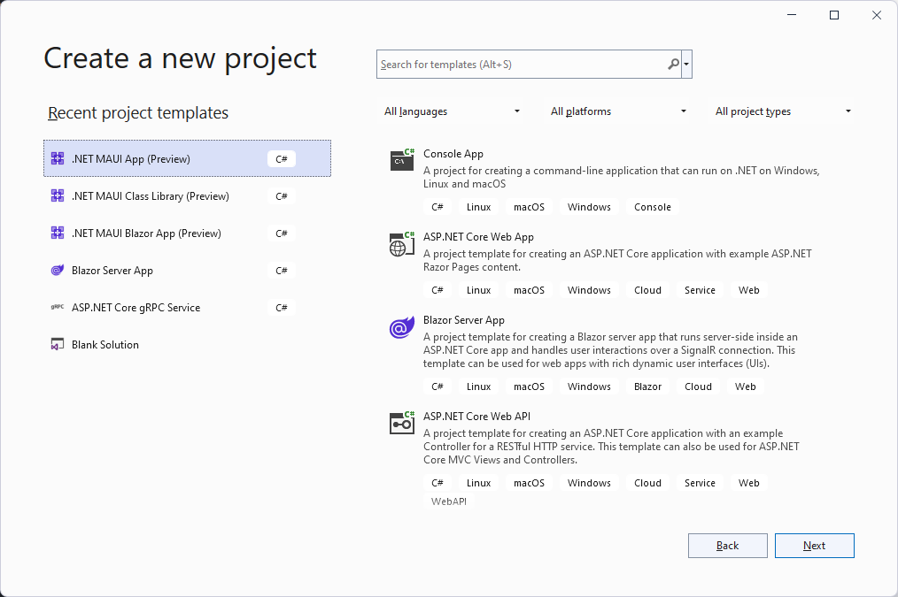
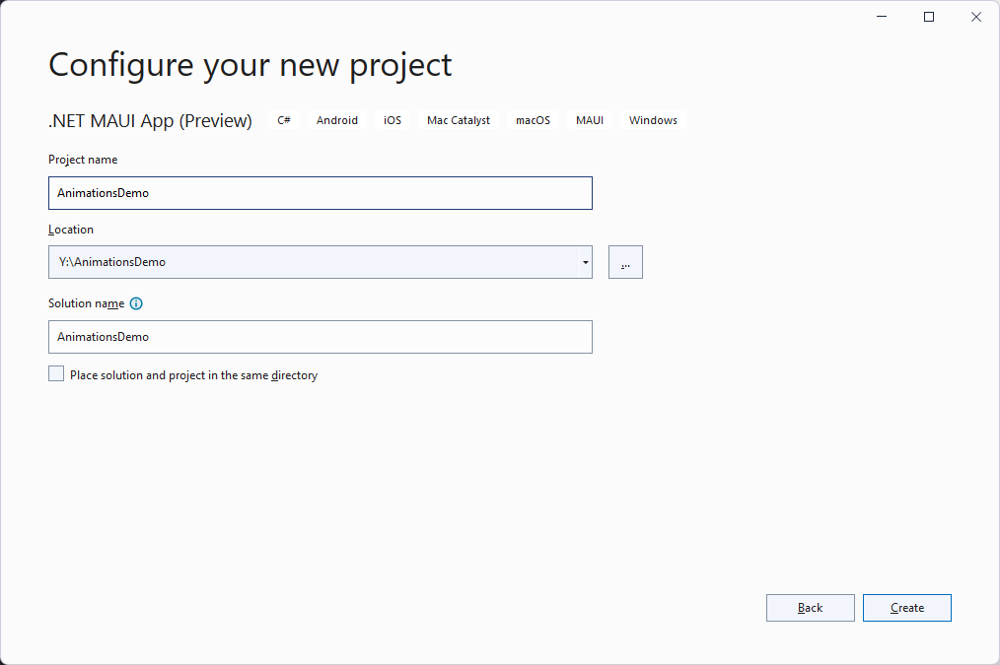

# Animations Demo

## Create a new .NET MAUI App

  
  

## Update UI Elements in MainPage.xaml

* Change Label's Text from Current count: 0 to Last animation: None
* Change Label's x:Name="CounterLabel" to x:Name="AnimationLabel"
* Change Click me button to Animate Me, Cancel Animation, and Reset buttons

From

```xml
            <Button 
                Text="Click me"
                FontAttributes="Bold"
                SemanticProperties.Hint="Counts the number of times you click"
                Clicked="OnCounterClicked"
                HorizontalOptions="Center" />
```

To

```xml
            <HorizontalStackLayout Spacing="25" Padding="30" >
                <Button 
                Text="Animate Me"
                FontAttributes="Bold"
                SemanticProperties.Hint="Animate dot net bot"
                Clicked="OnAnimationClicked"
                HorizontalOptions="Center" />

                <Button 
                Text="Cancel Animation"
                FontAttributes="Bold"
                SemanticProperties.Hint="Cancel the dot net bot animation"
                Clicked="OnCancelAnimationClicked"
                HorizontalOptions="Center" />

                <Button 
                Text="Reset"
                FontAttributes="Bold"
                SemanticProperties.Hint="Resets the dot net bot properties"
                Clicked="OnResetClicked"
                HorizontalOptions="Center" />                
            </HorizontalStackLayout>
```

* Add x:Name to the bot image element

From

```xml
            <Image
                Source="dotnet_bot.png"
                SemanticProperties.Description="Cute dot net bot waving hi to you!"
                WidthRequest="250"
                HeightRequest="310"
                HorizontalOptions="Center" />
```

To

```xml
            <Image
                x:Name="dotNetBotImage"
                Source="dotnet_bot.png"
                SemanticProperties.Description="Cute dot net bot waving hi to you!"
                WidthRequest="250"
                HeightRequest="500"
                HorizontalOptions="Center" />
```

## Complete MainPage.xaml should look like this

```xml
<?xml version="1.0" encoding="utf-8" ?>
<ContentPage xmlns="http://schemas.microsoft.com/dotnet/2021/maui"
             xmlns:x="http://schemas.microsoft.com/winfx/2009/xaml"
             x:Class="AnimationsDemo.MainPage">

    <ScrollView>
        <VerticalStackLayout Spacing="25" Padding="30">

            <Label 
                Text="Hello, World!"
                SemanticProperties.HeadingLevel="Level1"
                FontSize="32"
                HorizontalOptions="Center" />

            <Label 
                Text="Welcome to .NET Multi-platform App UI"
                SemanticProperties.HeadingLevel="Level1"
                SemanticProperties.Description="Welcome to dot net Multi platform App U I"
                FontSize="18"
                HorizontalOptions="Center" />

            <Label 
                Text="Last animation: None"
                FontSize="18"
                FontAttributes="Bold"
                x:Name="AnimationLabel"
                HorizontalOptions="Center" />

            <HorizontalStackLayout Spacing="25" Padding="30" >
                <Button 
                Text="Animate Me"
                FontAttributes="Bold"
                SemanticProperties.Hint="Animate dot net bot"
                Clicked="OnAnimationClicked"
                HorizontalOptions="Center" />

                <Button 
                Text="Cancel Animation"
                FontAttributes="Bold"
                SemanticProperties.Hint="Cancel the dot net bot animation"
                Clicked="OnCancelAnimationClicked"
                HorizontalOptions="Center" />

                <Button 
                Text="Reset"
                FontAttributes="Bold"
                SemanticProperties.Hint="Resets the dot net bot properties"
                Clicked="OnResetClicked"
                HorizontalOptions="Center" />
            </HorizontalStackLayout>

            <Image
                x:Name="dotNetBotImage"
                Source="dotnet_bot.png"
                SemanticProperties.Description="Cute dot net bot waving hi to you!"
                WidthRequest="250"
                HeightRequest="500"
                HorizontalOptions="Center" />

        </VerticalStackLayout>
    </ScrollView>
</ContentPage>
```

## Update Code in MainPage.xaml.cs

* Add ResetProperties method

```csharp
    private async void ResetProperties()
    {
        SemanticScreenReader.Announce("Reset properties");
        await Task.Delay(1000);
        dotNetBotImage.Rotation = 0;
        dotNetBotImage.Scale = 1;
        dotNetBotImage.TranslationX = 0;
        dotNetBotImage.TranslationY = 0;
    }
```

* Add ChangeAnimationLabel method

```csharp
    AnimationLabel.Text = $"Last animation: {text}";
```

* Add RandomAnimation method

```csharp
    private async void RandomAnimation()
    {
        var animation = new Random().Next(1, 7);

        switch (animation)
        {
            case 1:
                await FadeToAnimation();
                break;
            case 2:
                await RotateAnimation();
                break;
            case 3:
                await ScaleAnimation();
                break;
            case 4:
                await TranslateAnimation();
                break;
            case 5:
                await CompositeAnimation();
                break;
            case 6:
                await EasingBounceOutAnimation();
                break;
            default:
                break;
        }
    }
```

* Add RandomAnimation method
```csharp
    private async void RandomAnimation()
    {
        var animation = new Random().Next(1, 7);

        switch (animation)
        {
            case 1:
                await FadeToAnimation();
                break;
            case 2:
                await RotateAnimation();
                break;
            case 3:
                await ScaleAnimation();
                break;
            case 4:
                await TranslateAnimation();
                break;
            case 5:
                await CompositeAnimation();
                break;
            case 6:
                await EasingBounceOutAnimation();
                break;
            default:
                break;
        }
    }

```

* Add FadeToAnimation method

```csharp
    private async Task FadeToAnimation()
    {
        ChangeAnimationLabel("FadeTo");

        await dotNetBotImage.FadeTo(0, 500);
        await dotNetBotImage.FadeTo(1, 500);
        ResetProperties();
    }

```

* Add RotateAnimation method

```csharp
    private async Task RotateAnimation()
    {
        ChangeAnimationLabel("Rotate");

        await dotNetBotImage.RotateTo(360, 500);
        ResetProperties();
    }
```

* Add ScaleAnimation method

```csharp
    private async Task ScaleAnimation()
    {
        ChangeAnimationLabel("Scale");
        await dotNetBotImage.ScaleTo(2, 500);
        await dotNetBotImage.ScaleTo(1, 500);
        ResetProperties();
    }
```

* Add TranslateAnimation method

```csharp
    private async Task TranslateAnimation()
    {
        ChangeAnimationLabel("Translate");
        await dotNetBotImage.TranslateTo(-200, 0, 500);
        await dotNetBotImage.TranslateTo(0, 0, 500);
        ResetProperties();
    }
```

* Add CompositeAnimation method

```csharp
    private async Task CompositeAnimation()
    {
        ChangeAnimationLabel("Rotate");
        // Composite animation
        // A composite animation is a combination of animations where two or more animations run simultaneously.
        // Composite animations can be created by combining awaited and non-awaited animations:
        // Set Rotation to 0, otherwise the second time this animation runs, it won't rotate.
        dotNetBotImage.Rotation = 0;
        dotNetBotImage.RotateTo(360, 1000);
        await dotNetBotImage.ScaleTo(2, 500);
        await dotNetBotImage.ScaleTo(1, 500);
        ResetProperties();
    }
```

* Add EasingBounceOutAnimation method

```csharp
    private async Task EasingBounceOutAnimation()
    {
        ChangeAnimationLabel("Easing BounceOut");
        // This one took me like 2 hours to figure out. The last +25 it's because of the Spacing="25"
        // in the VerticalStackLayout setup. It works with any screen size.
        var translateToCoordinateY = Height - dotNetBotImage.Height - (dotNetBotImage.Height / 2) + 25;
        await dotNetBotImage.TranslateTo(0, translateToCoordinateY, 2000, Easing.BounceOut);
        ResetProperties();
    }
```

## Complete MainPage.xaml.cs should look like this

```csharp
namespace AnimationsDemo;

public partial class MainPage : ContentPage
{
    public MainPage()
    {
        InitializeComponent();
    }

    private void OnAnimationClicked(object sender, EventArgs e)
    {
        SemanticScreenReader.Announce(AnimationLabel.Text);
        RandomAnimation();
    }

    private void OnCancelAnimationClicked(object sender, EventArgs e)
    {
        SemanticScreenReader.Announce("Cancel animation");
        dotNetBotImage.CancelAnimations();
    }

    private void OnResetClicked(object sender, EventArgs e)
    {
        ResetProperties();
    }

    private async void ResetProperties()
    {
        SemanticScreenReader.Announce("Reset properties");
        await Task.Delay(1000);
        dotNetBotImage.Rotation = 0;
        dotNetBotImage.Scale = 1;
        dotNetBotImage.TranslationX = 0;
        dotNetBotImage.TranslationY = 0;
    }

    private async void RandomAnimation()
    {
        var animation = new Random().Next(1, 7);

        switch (animation)
        {
            case 1:
                await FadeToAnimation();
                break;
            case 2:
                await RotateAnimation();
                break;
            case 3:
                await ScaleAnimation();
                break;
            case 4:
                await TranslateAnimation();
                break;
            case 5:
                await CompositeAnimation();
                break;
            case 6:
                await EasingBounceOutAnimation();
                break;
            default:
                break;
        }
    }
    private void ChangeAnimationLabel(string text)
    {
        AnimationLabel.Text = $"Last animation: {text}";
    }

    private async Task FadeToAnimation()
    {
        ChangeAnimationLabel("FadeTo");

        await dotNetBotImage.FadeTo(0, 500);
        await dotNetBotImage.FadeTo(1, 500);
        ResetProperties();
    }

    private async Task RotateAnimation()
    {
        ChangeAnimationLabel("Rotate");

        await dotNetBotImage.RotateTo(360, 500);
        ResetProperties();
    }

    private async Task ScaleAnimation()
    {
        ChangeAnimationLabel("Scale");
        await dotNetBotImage.ScaleTo(2, 500);
        await dotNetBotImage.ScaleTo(1, 500);
        ResetProperties();
    }

    private async Task TranslateAnimation()
    {
        ChangeAnimationLabel("Translate");
        await dotNetBotImage.TranslateTo(-200, 0, 500);
        await dotNetBotImage.TranslateTo(0, 0, 500);
        ResetProperties();
    }

    private async Task CompositeAnimation()
    {
        ChangeAnimationLabel("Rotate");
        // Composite animation
        // A composite animation is a combination of animations where two or more animations run simultaneously.
        // Composite animations can be created by combining awaited and non-awaited animations:
        // Set Rotation to 0, otherwise the second time this animation runs, it won't rotate.
        dotNetBotImage.Rotation = 0;
        dotNetBotImage.RotateTo(360, 1000);
        await dotNetBotImage.ScaleTo(2, 500);
        await dotNetBotImage.ScaleTo(1, 500);
        ResetProperties();
    }

    private async Task EasingBounceOutAnimation()
    {
        ChangeAnimationLabel("Easing BounceOut");
        // This one took me like 2 hours to figure out. The last +25 it's because of the Spacing="25"
        // in the VerticalStackLayout setup. It works with any screen size.
        var translateToCoordinateY = Height - dotNetBotImage.Height - (dotNetBotImage.Height / 2) + 25;
        await dotNetBotImage.TranslateTo(0, translateToCoordinateY, 2000, Easing.BounceOut);
        ResetProperties();
    }
}
```

## Complete Code

<https://github.com/payini/Animations>

## Resources

<https://docs.microsoft.com/en-us/dotnet/maui/user-interface/animation/basic>
<https://docs.microsoft.com/en-us/dotnet/maui/user-interface/animation/easing>
